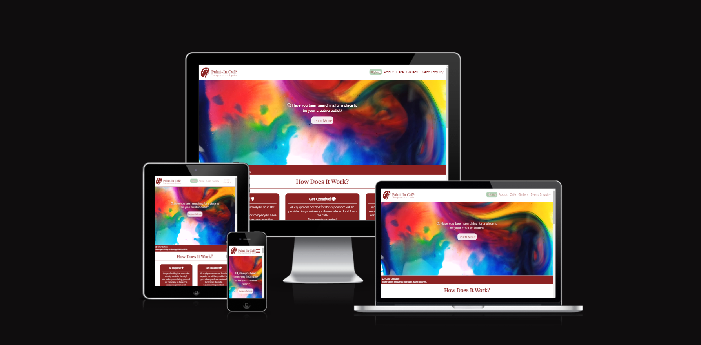

# Paint-in Cafe
This website is built for all the residents or tourists of Ireland(ROI) looking to do a creative activity in Dublin,Ireland.The website is based on a fictional cafe that allows you the unique experience of painting with watercolors while also eating from the cafe.This website is designed for code institute full stack program portfolio project 1 and it is built to be responsive to allow users from any browser to view the cafe website on any device.

### Live Link to website 
[View Paint-in Cafe website on Github pages](https://sooryageorge7.github.io/Paint-In-Cafe/index.html)

---

## CONTENT
* [User Experience(UX)](#user-experience(ux))
  * [Brief](#brief)
  * [User Objectives](#user-objectives)
* [Design](#design)
  * [Color Scheme](#color-scheme)
  * [Typography](#typography)
  * [Imagery](#imagery)
  * [Wireframes](#wireframes)
* [Features](#features)
  * [General Features Per Page](#general-features-per-page)
  * [Future Implementation](#future-implementation)
  * [Accessibility](#accessibility)
* [Technologies Used](#technologies-used)
  * [Languages Used](#languages-used)
  * [Frameworks, Libraries & Programs Used](#frameworks,-libraries-&-programs-used)
* [Deployment & Local Development](#deployment-&-local-development)
  * [Deployment](#deployment)
  * [Local Development](#local-development)
    * [How to Fork](#how-to-fork)
    * [How to Clone](#how-to-clone)
* [Testing](#testing)
  * [Automated Testing](#automated-testing)
    * [W3C Validator](#w3c-validator)
    * [Lighthouse](#lighthouse)
    * [Wave](#wave)
  * [Manual Testing](#manual-testing)
    * [Testing User Stories](#testing-user-stories)
    * [Full Testing](#full-testing)
  * [BUGS](#bugs)
    * [Known Bugs](#known-bugs)
    * [Solved Bugs](#solved-bugs)
* [Credits](#credits)
  * [Code Used](#code-used)
  * [Content](#content)
  * [Media](#media)
  * [Acknowledgement](#acknowledgement)

---

### Brief
Paint-In Cafe is a Cafe based in Dublin, Ireland. Visitors of the cafe are provided with the necessory equipment to paint with watercolors while having the option to order from our food menu as well.It is the place to go to when you want to do a creative activity to do with any number of people.This website is created for any users/ first time visitors to understand the cafe's concept, get contact details, find location of the cafe or send in an inquiry to the "paint-in cafe's " staff inorder to accomodate their specific needs.

## User Experience(UX)

### Key information 
* The cost involved (Cafe and experience).
* Do you need prior experience in painting?
* Is there an age limit?
* Do i need to book?
* Opening times and location.
* Contact details incase you need to get clarification on a specific problem.
* Extras included in cafe food, veg and vegan options?
* Is the food halaal?
* How to book for an event?- event enquiry
* Any updates on the cafe?

### User Stories

#### Owner's Goals
* To be able to allow the users to view the website on different devices.
* To allow potential customers to find out about Paint-In Cafe and where its located.
* To allow potential customers learn about the concept of the cafe and understand what they need to do to visit.
* To ensure visitors have access to contact details incase they have any questions with regards to the cafe.
* To ensure customers know exactly what they get out of the experience.
* To allow customers to be able to book tables in case of events.
* To be able to view the site in dark or lightmode with ease.
* To ensure that the visitor can easily navigate through the site and give good user experience.
* To ensure visitors can access the site's social media pages.
* To generate traffic to website.
* To allow website visitors to submit form succesfully and for the user to recieve feeback on submission.

#### First Time Visitor Goals
* To be able to find any information that is needed before visiting cafe.
* To find the enquiry form to submit in the case of wanting to book a table for an event.
* To be able to view gallery pictures of the cafe and paintings done at the cafe.
* To  view the menu of the cafe on the site to see their options for food and prices.
* To find out about prices.
* To  have contact information incase they have any questions. 
* To find out about location and opening times.

#### Returning Visitor Goals
* To be able to find any updates about the cafe on the home page.
* Find contact details of Cafe in case they have any questions with regarding to their experience at the cafe.
* To be able to find their own pictures in the gallery.
* To find social media pages of the website.

---

## Design

### Color Scheme
*[Initial Paint-In cafe color palette](documentation/paint-in-caf%C3%A9-color-palette.png)

I initially inserted the color palette above thinking that the colors appear the same(atleast almost) on all devices.After finishing the website and checking my website on other devices i realised that my colors looked very different from my own laptop. 
I thought the color **#67D387** was a pastel mint green color but it appeared bright green on other devices.The **#7B9F82** was supposed to be a grey color which turned out to be a shade of green on other devices. I decided to change these two colors to accomodate my device and other devices. I tested the color **#C4C3C7** and **#ADD0B3** below and they looked more like the colors i wanted in all the other devices.
I used pastel green color because i find green to be a calming color and i found that a lot of art websites used **pastel** colors. I thought the dark red(**#8C2323**) gives a good contrast to the pastel green and it may also be reminscent of the cafe interior and dark furniture. The white and grey helps with the flow and balance of the two contrast colors.I decided againt using the **#F0996A** because the color ddnt flow nicely with the design and i ddnt know how to incorporate without it clashing with the other colors.

**Final Color Palette**

---

### Typography

I used these two Google Fonts for headings and other texts because they pair well together.
I used [Typ.io](https://typ.io/) to help with pairing.
* [Playfair Display](https://fonts.google.com/specimen/Playfair+Display)-This is a transitional serif typeface and i used this for headings.
* [Open Sans](https://fonts.google.com/specimen/Open+Sans)-This is a humanist sans serif typeface and i used this for paragraphs and other texts.

### Imagery
All images in the website were taken from a free image source called Pexels.I have included the links to the images in [Credits](#credits) section.
* [Pexels website](https://www.pexels.com/)-Used for all images and videos in website.
* [svgrepo](https://www.svgrepo.com/svg/105795/paintbrush-and-palette)-Used for the logo and favicon.
* [TinyPNG](https://www.tinypng.com/)-Used to compress images.
* [Birme](https://www.birme.net/)-Used to change formating to increase accessibility.

### Wireframes
Wireframes for mobile, tablet and desktop view
* **HOME PAGE**
* **ABOUT PAGE** 
* **CAFE PAGE** 
* **GALLERY PAGE** 
* **EVENTS ENQUIRY PAGE**

* The final designs look very different to initial wireframe designs because i started thinking more and more about user experience and design flow and realized i had to change a lot.I have also added a Thank you page for after user submits form.

---
## Features

### General Features Per Page

The website has 5 main pages and 1 thank you page that appears once you click submit on the form. The pages `Home`, `About`,`Cafe`, `Gallery`,`Event Enquiry` are placed as navigation links on the first/home page on the top rightside if the website is displayed on bigger screens. The navgation links to these pages are removed and placed as a hamburger toggler button when viewed on a mobile.This is done to to save space avoid looking cluttered in mobile-view.Each page will have the header element  and footer element that will be consistent thoughout the pages.The website is designed to be easy to navigate for first time visitors on the site.The texts and boxes on the pages will appear more centerd in smaller devices like mobile and will move horizontally when in bigger devices.

#### General Features 

* For all the pages there will be a header consisting of navigation links that allow you to move from one page to another.
* The header element will also have Cafe's logo and name on far left. When hovered over, the cursor becomes pointer and allows you to press the logo and name which then takes you directly to return to home page of cafe website.
* For smaller screen the navigation links appear when you press on toggler button that is displayed as 3 bars or hamburger toggler top right on the smaller screen.

* The navigation links when hovered ontop or when clicked, the background color and color of text changes to #ADD0B3 and white.
* The colors match both in small screens and large screens. 

* The footer contains social media links, copyright statement, opening times, contact details, and location of cafe.
* The maps button takes you directly to google maps.
* The social media links take you directly to facebook and instagram.
* When hovered on the social media links and maps button, the color changes to #ADD0B3, allowing the user to know that they can be clicked on.
---
#### Home Page features
This page should attract first time visitors and want them to keep navigating through the website.It has colourful images and 
 a background video . Easy to read information about the cafe's concept and how it works- This is broken down into different blocks so that the information isnt too overwhelming and easy to find. The information is layed out in a way so that the common infomration that the first-time users may be looking for can be found without hassle.It also Shows contact details, location and opening times as well as social media links as part of the footer.

 
In addition to header and footer, the home page shows the following:

* A background video with text overlying with a `Learn More`button-When hovered on it turns the same color as the nav links.This button takes you to the main section of home page which tells the user about the concept of cafe and all the information that they might look for when visiting the site. 

* There is a cafe updates feature just below the background video that shows and updates.

* The main section of the page is divided into divs. Each div contains information that would be useful to the user, one of the div also allows you to access event enquiry page directly by allowing you to click on the text that says **Event Enquiry** page. 

 ---

#### About Page
This page shows how Paint-in cafe came about, information about when it was built, A deep dive into the background story of the owner and even more details about the cafe. 

In addition to the general features of all pages , the about page has the following:

* It has a background video with text overlying that specifies that this is the `About` page.

* A section with heading and 2 divs that serves the user information in **bite** size portions. The picture of owner is included(fictional charector) in this section.

---

#### Cafe Page

This page has the food menu for the cafe. It will also show information that shows that halaal, vegan and gluten free options are available on request.Costs are shown so that the user can be prepared before coming into the cafe. Image of a section of the Cafe is included.

In addition to the general features of all page , the about page has the following:
* It has a background video with text overlying that specifies that this is the `Cafe` page

* It has a section containing 3 blocks that has the menu for the cafe and optional extras text below the menu as well.

---

#### Gallery Page

This page has images of paintings, people and food inorder to attract potential customers to visit the cafe.These are placed in the gallery to inspire potential customers to share the cafe website to their family or friends.

In addition to the general features of all page , the about page has the following:
* It has a background video with text overlying that specifies that this is the `Gallery` page which contains the title **Gallery**.

* It has a section that contains all the photos i have saved from [Pexels] and a heading.(https://www.pexels.com/search/paintbrushes/) with heading.

* Scroll up button that will return you to the top of page when pressed on.

---

#### Event Enquiry Page

This page has a form that should be filled in if you want to host an event at the cafe or if you are a group of 10 people and more. The form contains name, email address, contact no., type of event, no. of people, special requests and a submit button.

In addition to the general features of all page , the about page has the following:

* It has a background video with text overlying that specifies that this is the `Event Enquiry` page.

* The main section with heading and 2  divs , one containing information on when and how to send enquiry on the form and the other containing the form itself where certain information needs to be filled in or selected to submit form.

Once you have submitted the form by clicking the submit button, The website will lead you to a thank you page where you can still navigate back to home page if needed.

#### Thank you page

You can have a look at the thank you page here.
* [Thank you page](documentation/thankyou-page.png)

---

### Future Implementation

* I really wanted to make a slideshow of pictures in the home page and events page but learnt that i would need to use javascript inroder to do so.
* I would implement making the gallery images in gallery page clickable and to appear full size when clicked on.
* I would use javascript for my fixed images in my website to work properly on IOS devices. See more in [Known Bugs](#known-bugs)

If this website was based on a real cafe:-
* I'd want to implement google reviews in the website so that website visitors would be able to understand the experience from the customer's point of view.
* Change the gallery page outlay to display previous customer's artwork, returning customers will be able to go check out their paintings in the gallery.
* Implement a share button inorder for site visitors to share the website with others. 
* I would have liked to include a video of the cafe's concept to help the user understand better.
* I would also include an art class page for customers who actually want to sign up for evening art classes.
* It would also be intersting to have best artwork of the month awards section in the home page.

---

### Accessibility

These are the ways i have ensured to provide accessibility to users:
* Used HTML semantics.
* Provided navigation links to access other pages.
* Used rem and % for font sizes and image sizes throughout website because it can scale up or down according to user's device.
* Highlighted the navigation link to the current page you are on.
* Ensured Colour Contrast so that the websites are easily readable in light and dark mode.
* Provided alt for images incase images do not load.
* Provided information for icons where no text was provided.
* Provided a submit button in the contact form which will then direct you to a thank you page with navigation links still displayed so that you can navigate around the website more if needed. 
* Aria labels were implemented for links and videos.[Learnt you can use aria-labels for videos here](https://www.w3.org/WAI/PF/HTML/wiki/Media_Alt_Technologies)
* Google font "Playfair display" was chosen carefully and i chose the pairing to this font "Open Sans" here [Playfair display pairing](https://typ.io/fonts/playfair_display#:~:text=Playfair%20Display%20is%20a%20serif,Work%20Sans%2C%20Circular%20and%20Georgia.).

---

## Technologies Used

### Languages Used
HTML and CSS was mainly used to build this website. 

### Frameworks, Libraries and Programs Used

* [Balsamiq](https://balsamiq.com/) - For Wireframes for planning of design.
* [Gitpod](https://www.gitpod.io/) - To edit code/ code editor.
* [GitHub](https://github.com/) - for version control, storage and deployment
* [Font Awesome](https://fontawesome.com/) - For all the icons in all the pages.
* [Typ.io](https://typ.io/) - To choose pairing of fonts.
* [Google Fonts](https://fontawesome.com/v4/icons/) - To choose Heading font and body font.
* [Chrome Dev Tools](https://developer.chrome.com/docs/devtools/) - To help with troubleshoot, testing , checking for responsiveness and styling.
* [Am I Responsive](https://ui.dev/amiresponsive) - To show a display of website on a variety of devices.
* [Favicon](https://favicon.io/favicon-converter/) - To generate favicon
* [Birme](https://www.birme.net/) - To change image format to webp
* [Tiny PNG](https://tinypng.com/) - To compress images.
* [Coolors](https://coolors.co/) - To pick color palette.
* [SVG repo](https://www.svgrepo.com/) - To help pick logoimage and image for favicon. 

---

## Deployment & Local Development

### Deployment
To create a live website of Paint-In Cafe, deployment was done using github pages. The step by step process is shown below:
1. Log in or Sign up to github.
2. Find the repository for this project,Paint-In Cafe.(Can be found under top repositories on the left hand side)
3. Click on Settings link that is displayed above and left to the green gitpod button.
4. Click on Pages link under code and automation in the navigation bar on the left hand side.
5. Under Build and Deployment, click on the branch drop down menu and select main and make sure the select folder drop down is selected on root.
6. Now click save and wait a few minutes.
7. Refresh the page, and the url for your live website will be shown under the heading, GitHub Pages.
8. Deployment is now complete.

### Local Development
#### How to Fork
To fork the Paint-In-Cafe Repository: 
1. Log in or Sign up to github.
2. Find the repository for this project, SooryaGeorge7/Paint-In-Cafe.
3. Click the fork button on top right corner. 
#### How to Clone
To clone the Paint-In-Cafe Repository: 
1. Log in or Sign up to github.
2. Find the repository for this proect, SooryaGeorge7/Paint-In-Cafe.
3. Click on Code button just left to the green gitpod button.
4. Select what you would like to clone with (HTTPS/SSH/GitHub CLI) and copy the link shown below.
5. Open the terminal in your code editor(eg. Gitpod) and change the current working directory to the location you want to use for cloned directory.
6. In the terminal type in "git clone" and paste the link you copied in step 4 above. Press enter.
7. Cloning is now completed.

---

## Testing

I used chrome developer tools extensively while developing the project.

Once my project was submitted for peer-code-review, the following issues were raised to me: 
1) When clicking on the logo, the website took you directly to the footer instead of home page.-This was done on purpose initially because i wanted the user to have the details in the footer as easily accessible as possible but my mentor confirmed to changing the href of logo to the home page(index.html) too.
2) When clicking form submit button, the submit button allowed a pop up messaging without validating any of the inputs given by user.-The form method was changed to "GET" and action to "thankyou.html which led you to thank you page once you are able to submit and changing input type and adding required attribute.The "onclick" javascript function was removed from the code as the pop alert message will be shown even with invalid inputs.

### W3C Validator

I used W3C validator website to validate HTML and CSS of my website. The image links of each page is listed down below:

* [Home page html validation](documentation/home-page-w3c.png)
* [About page html validation](documentation/about-page-w3c.png)
* [Cafe page html validation](documentation/cafe-page-w3c.png)
* [Gallery page html validation](documentation/gallery-page-w3c.png)
* [Events page html validation](documentation/event-page-w3c.png)
* [Thank you page html validation](documentation/thankyou-page-w3c.png)
* [Style.css CSS](documentation/css-jigsaw-validation.png)

### Lighthouse

I used lighthouse testing that is within chrome developer tools for testing the cafe's performance, accessibility, best practices and SEO(Search Engine Optimisation)

#### Home page

Link to Initial testing on desktop and mobile:
* [Home page initial lighthouse testing](documentation/home-page-initial-lighthouse.png)

Opportunities/suggestions:
* Consider adding `preconnect` or `dns-prefetch` resource hints to establish early connections to important third-party origins.
* Back ground and foreground don’t have enough sufficient contrast ratio.-Lighthouse suggested changing color of cafe updates div background color.

Final Lighthouse score of Home page:
* Desktop(Light & Dark mode)-

* Mobile(Light & Dark mode)-

 #### About page

 Link to initial testing on desktop and mobile:
 * [About page initial lighthouse testing](documentation/aboutpage-initial-lighthouse.png)

 Opportunities/suggestions:
 * Displays images with incorrect aspect ratio.Image display dimensions should match natural aspect ratio.- I changed the height and width attributes of about page image to ensure correct aspect ratio of image in all screens.

 Final lighthouse score of About page:
 * Desktop(Light & Dark mode)-
 
 
 * Mobile(Light & Dark mode)-
 
 

 #### Cafe page

 Link to initial testing on desktop and mobile:
 * [Cafe page initial lighthouse testing](documentation/cafepage-initial-lighthouse.png)

 Opportunities/suggestions:
 * Heading elements are not in a sequentially-descending order- My cafe menu divs's headings were h3 and the page heading was h1, i added another h2 between the two heading to compensate.

 Final lighthouse score of Cafe page:
 * Desktop(Light & Dark mode)-
 
 
 * Mobile(Light & Dark mode)-
 
 

 #### Gallery page

 Link to initial testing on desktop and mobile:
 * [Gallery page initial lighthouse testing](documentation/gallery-initial-lighthouse.png)

 Opportunities/suggestions:
 * Links do not have a discernible name- I added aria-label to scroll button a tag in gallery.html
 * Image display dimensions should match natural aspect ratio- The images stretched  when displayed in bigger devices and i added object-fit attribute with value cover to fix this issue.

 Final lighthouse score of Gallery page:
 * Desktop(Light & Dark mode)- 
 
 
 * Mobile(Light & Dark mode)-
 
 

 #### Event Enquiry page

 Link to initial testing on desktop and mobile:
 * [Event Enquiry page initial lighthouse testing](documentation/eventpage-initial-lighthouse.png)

 Opportunities/suggestions:
 * Serve images that are appropriately-sized to save cellular data and improve load time- I compressed the images in the website using tiny.png and changed format of images to WebP format.

 Final lighthouse score of Event Enquiry page:
 * Desktop(Light & Dark mode)-
 
 
 * Mobile(Light & Dark mode)-
 
 

 #### Thank You Page

 I tested the thank you page once and had really great results, and did not have any suggestions.

 Lighthouse score of Thank you page:
 * Desktop(Light & Dark mode)-

 

 * Mobile(Light & Dark mode)-

 

---

### Manual Testing

#### Testing User Stories(UX)

#### Owner's Goals
* To be able to view the site on different device sizes.
  * Responsiveness was achieved though media queries and chrome dev tools were used to help inspect the site in varying sizes.
* To allow potential customers to find out about Paint-In Cafe and where its located.
  * The footer contains information about location.The location section in the footer also has a maps button that will direct you to google maps location. 
  * Social media links allows the website to reach more customers.
* To allow potential customers to learn about the concept of the cafe and understand what they need to do to visit.
  * The home page has a text overlying the background video that asks the site visitor a question and the button below says "learn more". If you click on the button, the site will take the visitor to the concept section of home page where the visitor can learn more about Paint-in Cafe.
  * In the section under the heading "How does it work?", There are 6 divs that contain headings and information that the website visitor most likely would want to know more about. Eg: Bookings, experience, cafe. 
  * Gallery shows a few images from the cafe and experience so that the visitors know what to expect before visiting.
* To ensure visitors have access to contact details incase they have any questions with regards to the cafe.
  * Contact details are shown in footer of each page of website.
* To ensure customers know exactly what they get out of the experience.
  * Provide sufficient information about the experience, price of everything and also allow images of cafe and experence to be seen by potential customer.This is shown in the concept section in Home page, menu section in cafe page and from the images in gallery page.
* To allow customers to be able to book tables in case of events or are a group of 10+ people.
  * The navigation bar has an `Event Enquiry` page which takes visitors to a page that allows customers to fill in a form and submit the form. The page also has information as to when booking's are required.
  * The concept section in home page has an events enquiry link in the div that contains bookings.
  * The about page contains an event enquiry link in the information section as well.
* To be able to view the site in dark or lightmode with ease.
  * The colors chosen for website have sufficient contrast and the website was tested for lighthouse score in darkmode as well. 
* To ensure that the visitor can easily navigate through the site.
  * Navgation links are easy to find in both big and small screens and they change color when hovered or focused on a specific link.
* To ensure visitors can access the site's social media pages.
  * Social media icons that can be clicked are provided in the footer of each page.
* To generate traffic to website.
  * This was done by having social media pages of the website which are then shareable. 

#### First Time Visitor Goals
* To be able to find any information that is needed before visiting cafe.
  * The home page has all the information that visitors would need.For example, concept, price, bookings etc.
* To find the enquiry form to submit in the case of wanting to book a table for an event.
  * The navigation link on top has a link t event enquiry page where there is a form to submit incase of bookings needed.
  * The concept section in home page has an events enquiry link in the div that contains bookings.
  * The about page contains an event enquiry link in the information section as well.
* To be able to view gallery pictures of the cafe and paintings done at the cafe.
  * The images from the cafe are displayed in gallery page which can be viewed from the naviagtion links.
* To  view the menu of the cafe on the site to see their options for food and prices.
  * The cafe page has the cafe menu and prices so that the visitor would be able to plan accordingly before coming to cafe.
* To find out about prices.
  * The pricing is explained in the home page in the boxes under the heading "How does it work?" and in the cafe page as well.
* To  have contact information incase they have any questions. 
  * Contact information is provided in the footer of each page for user to access.
* To find out about location and opening times.
  * Location and Opening times are provided in the footer of each page for user to access.

#### Returning Visitor Goals
* To be able to find any updates about the cafe on the home page.
 * There is a `Cafe updates` section in home page where updates of cafe can be seen.
* Find contact details of Cafe in case they have any questions with regarding to their experience at the cafe.
 * Contact information is provided in the footer of each page.
* To be able to find their own pictures in the gallery.
  * Gallery images can be viewed in gallery page.
* To find social media pages of the website.
  * The social media pages can be accessed through their icons in the footer of each page.

--- 

#### Full Testing

1. When the site opens in your device, the home page is displayed.
2. The home page consists of a header that has a logo on top left corner, navigation links `Home` `About` `Cafe` `Gallery` `Event enquiry` on the top right corner and background video with overlying text.
3. The header is consistent through all the pages of the site.
4. The logo can be clicked on any page and the site will direct you back to home page.
5. The navigation links on top right corner are clicked to jump between the different pages of the website.
6. If a naviagtion link is hovered over or focused on, the color of the naviagtion link changes. The link you clicked on will direct you to the specific page that you want to go to.
7. If you look at the main home page, there is a background video with text overlying it with a button that says **"learn more"** which can be clicked on to be directed to the main section of home page.
8. The main section of home page has a 6 boxes or divs, 1 box called bookings has an **Events Enquiry** link that can be clicked on to be directed to the event enquiry page directly.This link should work.
9. If you scroll down even further, You will get to the footer of the page.It consists of opening times, contact details and location of cafe.These are displayed in 3 divs as flexbox. The footer is consistent through all the pages. .
10. The location div has a button that can be clicked on for you to be directed to Google maps.The footer also has facebook and instagram icons which can be accessed when clicked on. The color of the icons and button in footer should change when hovered on and focused on.
11. Once on the `About` page or `Cafe` page  , it has same layout like the home page.The pages contain the logo, navigation links and footer containing opening times, location, and contact details. Check these links and buttons in the `About` and `Cafe` page.Both pages have a section inbetween the footer and header.The headers also contain a background video and overlying text(heading).
12. The `Gallery` page has the same links as the home page, with the addition of a scrollup button. When clicked, it should direct you back to the top of the page.
13. The `Event Enquiry` page has the same layout,links and buttons as the other pages.Click all to see if they work. The event page also has a event enquiry form. The form has 1 text input type, 1 tel input type, 1 number input type, 1 email input type, 1 submit input type , a textarea and select element. Test each of these input fields to see if required attribute works.(The text area does not have required attribute).Click submit button to see if you will be directed towards the thankyou page.The thank you page has the same layout as events page except the section contains the background video with heading.
14. The thank you page still allows you to navigate back towards any of the other pages.

#### Browser and Responsiveness tests

I did full testing of all the links, buttons, the form on a number of browsers and i have displayed the results of each of them below:

✓- Works correctly.

|                 | Microsoft Edge | Google Chrome | Mozilla firefox | Safari |
| :---:           | :---| :--- | :--- | :---|
| Home Page | *Links - &check;  *Buttons - &check; *Form - &check; *Appearance -&check; |*Links - &check;  *Buttons -&check;  *Form - &check; *Appearance -&check; |*Links -&check;  *Buttons -&check;  *Form - &check; *Appearance -&check; |*Links - &check; *Buttons -&check;  *Form - &check; *Appearance -&check; except fixed image |
| About Page | *Links - &check;  *Buttons - &check; *Form - &check; *Appearance -&check; |*Links - &check;  *Buttons -&check;  *Form - &check; *Appearance -&check; |*Links -&check;  *Buttons -&check;  *Form - &check; *Appearance -&check; |*Links - &check; *Buttons -&check;  *Form - &check; *Appearance -&check; |
| Cafe Page | *Links - &check;  *Buttons - &check; *Form - &check; *Appearance -&check; |*Links - &check;  *Buttons -&check;  *Form - &check; *Appearance -&check; |*Links -&check;  *Buttons -&check;  *Form - &check; *Appearance -&check; |*Links - &check; *Buttons -&check;  *Form - &check; *Appearance -&check; except fixed image |
| Gallery Page | *Links - &check;  *Buttons - &check; *Form - &check; *Appearance -&check; |*Links - &check;  *Buttons -&check;  *Form - &check; *Appearance -&check; |*Links -&check;  *Buttons -&check;  *Form - &check; *Appearance -&check; |*Links - &check; *Buttons -&check;  *Form - &check; *Appearance -&check; |
| Event Enquiry Page | *Links - &check;  *Buttons - &check; *Form - &check; *Appearance -&check; |*Links - &check;  *Buttons -&check;  *Form - &check; *Appearance -&check; |*Links -&check;  *Buttons -&check;  *Form - &check; *Appearance -&check; |*Links - &check; *Buttons -&check;  *Form - &check; *Appearance -&check; |

I did test on a variety of devices as well and displayed below is a table showing results of each device:

|                 | S20 ultra | iPhone 12 Pro | Dell inspiron 3593 | Lenovo Thinkpad W541 |
| :---:           | :---| :--- | :--- | :---|
| Home Page | *Appearance -&check; |*Appearance -&check; except fixed image |*Appearance -&check; |*Appearance -&check; |
| About Page | *Appearance -&check; |*Appearance -&check; |*Appearance -&check; |*Appearance -&check; |
| Cafe Page | *Appearance -&check; |*Appearance -&check; except fixed image |*Appearance -&check; |*Appearance -&check; |
| Gallery Page | *Appearance -&check; |*Appearance -&check; |*Appearance -&check; |*Appearance -&check; |
| Event Enquiry Page | *Appearance -&check; |*Appearance -&check; |*Appearance -&check; |*Appearance -&check; |

See [Known Bugs](#known-bugs) for explanation of appearance for IOS device and Safari browsers.

### BUGS
#### Known Bugs

* It was brought to my attention that my fixed images(Images with style attribute position with value "fixed") in my home page and cafe page does not work on iphone devices/ IOS devices and safari browsers.I did not have any IOS devices at home and was not aware of it until a friend sent a screenshot to me from her iphone. The images appeared stretched or zoomed in and did not have the effect of a fixed image.My fixed images worked on my laptops, and all the  android devices. I had asked in Slack what could be the reason and was adviced by Grace Mckenna that IOS doesnt support that code and could be outside the scope of project 1. After some intense googling, i had found a solution for future implementation that says you can use javascript for it to work on iphone devices.[Stack overflow solution](https://stackoverflow.com/questions/20443574/fixed-background-image-with-ios7). At this point in my project , i was almost done with the project  and the readme file too.In the future i will be aware of it and try and see if i can implement javascript to have the desired effect on IOS devices.

#### Solved Bugs

* Making a herovideo that also acts as a background video. I couldnt use the background attribute in css  to add the background videos and make changes in that way. I had to insert video in a div in html and adjust the video using css to make it appear as a background video/gif rather than a video that stands alone.
* I could not fit navigation links in the smaller screens without it looking too cluttered or the font-size being ineligable.I decided to make a hamburger toggler for smaller screen which will show navigation links when clicked on.
* My menu of naviagtion links in smaller screens were not displaying properly because all the elements were on the same level, then i used z-index to make my menu higher than the other elements on the screen to make sure menu is displayed ontop of the other elements without the other elements showing through. 
* The background video did not want to center itself as the screensizes increased or decreased- this was fixed by adding a outer div to video and setting the position of div to relative while you position the video itself to absolute. Set the object-fit of video to cover. Set the bottom attribute of video to be 0.
* The images in gallery did not have the correct aspect ratio while doing lighthouse testing- I solved this by adding the css attribute object-fit with value of cover to every image in the gallery.
* The form submit button was allowing pop up message to occur without validating inputs given by user. - Changed the method attribute of form to "GET"and action to "thankyou.html" and removed onclick javascript function from input element.
* It was brought to my attention that background videos do not work on ios devices because autoplay is not supported by IOS devices, so i tried to find answers online and found a solution in stack overflow [Stack Overflow solutions](https://stackoverflow.com/questions/59325257/html5-video-background-not-playing-safari-on-iphone).I added playsinline attribute to my video elements and they seemed to help IOS devices to play the background video.I unfortunately do not have an ios device, my friend reassured me that the video worked on her phone after my changes.
---

## Credits

### Code Used
* [Code used to make hamburger toggler](https://www.codingnepalweb.com/responsive-navigation-menu-bar-html-css/)
* [Learnt how to make shadow to a section here](https://www.w3schools.com/css/css3_shadows_box.asp)
* [Learnt about flexbox here](https://www.youtube.com/watch?v=JJSoEo8JSnc&t=859s)
* [Got the code to make gallery to display as a flexbox so that it is responsive here](https://www.youtube.com/watch?v=Trw_9lisYVY)
* [learnt how to center the background video so that the video doesnt shrink according to screensizes here](https://www.youtube.com/watch?v=znqUwx0b0HI&t=8s)
* [Learnt to add scroll button in gallery using css and html only](https://www.youtube.com/watch?v=Vef9bxTilCU)
* [Learnt how to play backgroundvideos in IOS devices here](https://stackoverflow.com/questions/59325257/html5-video-background-not-playing-safari-on-iphone)

### Content
* All content in the website was written by me but i did draw inspiration from the websites below: 

1. [Clay Cafe](https://claycafeinthecity.com/)
2. [Color Cafe](https://www.colorcafe.co.za/)

### Media

#### Videos
All videos were downloaded from free open source [pexels](https://www.pexels.com/)

* [Home background video](https://www.pexels.com/video/abstract-painting-using-water-colors-4379020/)
* [About background video](https://www.pexels.com/video/flowing-color-mixture-7507908/)
* [Cafe background video](https://www.pexels.com/video/coffee-making-art-by-a-bartender-2909914/)
* [Gallery background video](https://www.pexels.com/video/playing-morning-music-view-4306403/)
* [Event enquiry background video](https://www.pexels.com/video/bouquet-of-helium-colored-balloons-3905909/)
* [Thank you background video](https://www.pexels.com/video/bouquet-of-helium-colored-balloons-3905909/)
#### Images 
All images were downloaded fromm free open source [pexels](https://www.pexels.com/), the exception being the logo image that appears in top left corner of every page which was downloaded from [SVG repo](https://www.svgrepo.com/)

Fixed images shown in home page and cafe page.
* [Concept photo in home page](https://www.pexels.com/photo/art-materials-on-blue-surface-5554775/)
* [Fixed image in Cafe page](https://www.pexels.com/photo/espresso-machine-dispensing-on-two-mugs-2067628/)

Other images.
* [Sunny Marie Photo(fictional owner)](https://www.pexels.com/photo/woman-in-black-sweater-holding-brush-watercolor-set-and-notebook-7181836/)
* [Paint-in Cafe logo image](https://www.svgrepo.com/)

Gallery images 
* [Mother helping her child with painting](https://www.pexels.com/photo/a-woman-in-white-long-sleeves-standing-near-her-student-painting-on-white-paper-7898456/)
* [3 friends at the cafe](https://www.pexels.com/photo/3-women-at-the-painting-class-6925357/)
* [Kid with paint on hands](https://www.pexels.com/photo/a-kid-with-multicolored-hand-paint-1148998/)
* [Little girl holding up a rainbow painting](https://www.pexels.com/photo/little-girl-holding-white-paper-with-rainbow-drawing-8363769/)
* [Lady painting a flower](https://www.pexels.com/photo/a-person-painting-on-a-paper-4860078/)
* [Lady with paint on her hands and eating food](https://www.pexels.com/photo/woman-happily-eating-a-croissant-5641782/)
* [Some cafe food](https://www.pexels.com/photo/espresso-on-teal-saucer-beside-baked-cake-2068296/)
* [Cafe interior](https://www.pexels.com/photo/top-view-photo-of-restaurant-2253643/)
* [Cafe coffee station](https://www.pexels.com/photo/coffee-bar-1995010/)
* [Watercolor brush in palette](https://www.pexels.com/photo/pain-palette-3551723/)
* [Painting pad](https://www.pexels.com/photo/blank-white-paper-beside-a-water-color-brush-8058580/)
* [Pancakes](https://www.pexels.com/photo/pancakes-with-sliced-strawberries-on-top-2965413/)
* [Two girls painting](https://www.pexels.com/photo/a-young-woman-painting-in-an-art-class-6925366/)
* [Someone cleaning their brush in glass container](https://www.pexels.com/photo/a-person-holding-blue-paintbrush-7898620/)
* [Couple taking a selfie](https://www.pexels.com/photo/couple-taking-selfie-while-eating-4046771/)
* [Bakery food](https://www.pexels.com/photo/overhead-shot-of-slices-of-cake-on-saucers-9795914/)

### Acknowledgement

I would like to acknowledge the following people in helping with me project one way or another: 

* My husband for supporting me through my decision to do this course and through all the late nights and meltdowns so far especially knowing that this will only get worse through the course of the year. :D 
* My friends ,family and colleagues who have tested my site on their devices to make sure all looks and works well.
* My Mentor Brian O'Hare for guiding me and giving constructive critism in our 3 mentor sessions so far.
* Kera cudmore's readme template helped me get comfortabe in starting my read me without it being too daunting.
* I want to thank Louise Benson and Szilvia Csernus for giving feedback in peer-code-review channel in Slack.
* I acknowledge Mckenna Grace for replying to my question about a bug on ask-anything slack group.
* UCD academy novemeber private group in slack for our almost weekly facilitator sessions that have helped in getting some our doubts cleared with regards to the project.
* Chris Quinn for delivering our facilitator and master classes so far which has helped me to not feel completly alone in this journey.
* I acknowledge Will Griffiths for replying to my question regarding background colors in slack. 